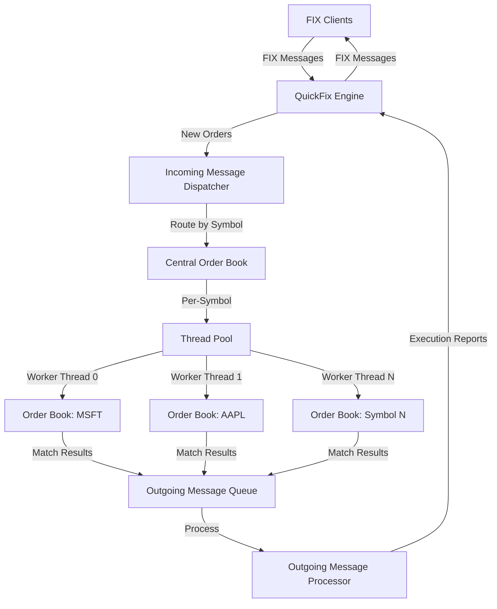

# C++ Multithreaded Order Matching Engine

## Overview

This is a **production-grade multithreaded order matching engine** written in C++11 that implements the FIX (Financial Information Exchange) protocol 4.2. The project demonstrates advanced concurrent programming techniques, lock-free data structures, and high-performance trading system architecture.

**Key Stats**:
- **Language**: C++11
- **Platforms**: Linux (CentOS, Ubuntu) and Windows (VS2013)
- **Compilers**: GCC 4.8, MSVC 120 (VS2013)
- **Dependencies**: Boost 1.59, QuickFix, GoogleTest 1.7
- **License**: Public Domain

---

## Architecture Overview

### High-Level Design



### Component Breakdown

The system follows a **multi-threaded producer-consumer pattern** with lock-free queues:

1. **FIX Engine Layer** (QuickFix)
   - Handles TCP connections and FIX protocol parsing
   - Session management and message validation

2. **Message Dispatcher**
   - Routes incoming orders to appropriate order books
   - Validates order types and symbols

3. **Central Order Book**
   - Manages multiple order books (one per security symbol)
   - Coordinates thread pool for parallel processing
   - Symbol → Queue ID mapping

4. **Thread Pool**
   - One worker thread per security symbol
   - Lock-free SPSC (Single Producer Single Consumer) queues
   - Optional CPU core pinning for performance

5. **Order Books**
   - Price-time priority matching algorithm
   - Separate bid/ask multimap structures
   - Matching logic per symbol

6. **Outgoing Message Processor**
   - Collects execution reports from all order books
   - Sends status updates back to clients via FIX

---

## Core Components

### 1. Order Matching Engine

#### Order Structure
[Order.h](source/order_matcher/order.h)

```cpp
class Order {
    std::string m_clientOrderID;
    FlyweightStdString m_symbol;        // Boost flyweight for memory efficiency
    std::string m_owner;
    FlyweightStdString m_target;
    OrderSide m_side;                   // BUY or SELL
    OrderType m_orderType;              // Currently only LIMIT
    double m_price;
    long m_quantity;
    long m_openQuantity;
    long m_executedQuantity;
    bool m_cancelled;
    double m_averageExecutedPrice;
    double m_lastExecutedPrice;
    long m_lastExecutedQuantity;
};
```

**Design Highlights**:
- Uses **Boost Flyweight** pattern for `symbol` and `target` strings to reduce memory footprint
- Tracks partial fills with `openQuantity` and `executedQuantity`
- Maintains execution statistics (average price, last executed price/quantity)

#### Order Book Implementation
[OrderBook.h](source/order_matcher/order_book.h)

```cpp
class OrderBook {
private:
    std::string m_symbol;
    
    // Bid orders: highest price on top
    std::multimap<double, Order, std::greater<double>> m_bidOrders;
    
    // Ask orders: lowest price on top
    std::multimap<double, Order, std::less<double>> m_askOrders;
    
    void matchTwoOrders(Order& bid, Order& ask);
};
```

**Matching Algorithm**:
- **Price-Time Priority**: Orders sorted by price, then insertion time
- **Bids**: Descending order (highest price first) using `std::greater`
- **Asks**: Ascending order (lowest price first) using `std::less`
- **Matching**: When top bid price ≥ top ask price, orders match

**Supported Order Types**:
- ✅ Limit orders (buy/sell at specified price or better)
- ❌ Market orders (future enhancement)
- ❌ Stop-loss orders (future enhancement)
- ❌ Time-In-Force (TIF) not yet supported

#### Central Order Book
[CentralOrderBook.h](source/order_matcher/central_order_book.h)

```cpp
class CentralOrderBook {
private:
    // Symbol → OrderBook mapping
    std::unordered_map<std::string, OrderBook> m_orderBookDictionary;
    
    // Symbol → Thread Queue ID mapping
    std::unordered_map<std::string, int> m_queueIDDictionary;
    
    // MPMC queue for outgoing messages
    OutgoingMessageQueue m_outgoingMessages;
    
    // Thread pool with one thread per symbol
    concurrent::ThreadPool m_orderBookThreadPool;
};
```

**Key Features**:
- **Symbol-based partitioning**: Each symbol processed by dedicated thread
- **Lock-free outgoing queue**: MPMC (Multi-Producer Multi-Consumer) for execution reports
- **Observer pattern**: Notifies observers of order book changes
- **Visitor pattern**: Allows traversal of all orders

---

### 2. Concurrency & Thread Management

#### Thread Pool Architecture
[ThreadPool.h](source/concurrent/thread_pool.h)

```cpp
struct ThreadPoolArguments {
    bool m_pinThreadsToCores;           // CPU affinity
    bool m_hyperThreading;              // Use logical cores?
    int m_workQueueSizePerThread;       // Queue capacity
    int m_threadStackSize;
    std::vector<std::string> m_threadNames;  // One per symbol
};

class ThreadPool {
private:
    std::vector<ThreadPtr> m_threads;
    std::vector<ThreadPoolQueuePtr> m_threadQueues;  // One queue per thread
    std::atomic<bool> m_isShuttingDown;
};
```

**Performance Optimizations**:
- **CPU Core Pinning**: Threads can be pinned to specific CPU cores to avoid context switching
- **Hyperthreading Control**: Can skip logical cores and use only physical cores
- **Dedicated Queues**: Each worker thread has its own lock-free queue (no contention)
- **Configurable Stack Size**: Allows tuning for deep call stacks

#### Lock-Free Ring Buffer (SPSC)
[RingBufferSPSCLockFree.hpp](source/concurrent/ring_buffer_spsc_lockfree.hpp)

```cpp
template<typename T>
class RingBufferSPSCLockFree {
private:
    std::atomic<int> m_write;
    std::atomic<int> m_read;
    std::size_t m_capacity;
    std::unique_ptr<T, BufferDeleter> m_buffer;

public:
    bool tryPush(T val) {
        const auto current_tail = m_write.load();
        const auto next_tail = increment(current_tail);
        if (next_tail != m_read.load(std::memory_order_acquire)) {
            m_buffer.get()[current_tail] = val;
            m_write.store(next_tail, std::memory_order_release);
            return true;
        }
        return false;
    }
};
```

**Lock-Free Design**:
- **Atomic Operations**: Uses `std::atomic` with acquire-release semantics
- **Memory Ordering**: Ensures visibility across threads without locks
- **Single Producer/Single Consumer**: Optimized for 1:1 thread communication
- **Bounded Queue**: Fixed capacity, no dynamic allocation during operation

**Concurrency Primitives Available**:
- ✅ `RingBufferSPSCLockFree` - Lock-free SPSC queue (used in thread pool)
- ⚠️ `QueueMPMC` - Multi-producer multi-consumer (not lock-free)
- ⚠️ `QueueMPSC` - Multi-producer single-consumer (not lock-free)
- ⚠️ `RingBufferMPMC` - MPMC ring buffer (not lock-free)

> **Note**: Only SPSC is truly lock-free. MPMC/MPSC implementations are planned for future enhancement.

---

### 3. Memory Management

The project includes custom **cache-aligned allocators** to optimize CPU cache performance:

#### Cache Line Awareness
[CacheLine.h](source/memory/cache_line.h)

```cpp
#define CACHE_LINE_SIZE 64  // Typical x86/x64 cache line size
```

#### Aligned Allocators
- `aligned_allocator.hpp` - STL-compatible allocator with alignment guarantees
- `aligned_memory.h` - Platform-specific aligned allocation (Windows/POSIX)
- `aligned_container_policy.hpp` - Policy-based allocator design

**Why Cache Alignment Matters**:
- **False Sharing Prevention**: Prevents different threads from invalidating each other's cache lines
- **Performance**: Ensures hot data structures fit within cache lines
- **NUMA Awareness**: Better performance on multi-socket systems

**Future Enhancements** (from TODO list):
- jemalloc integration
- Intel TBB allocators
- tcmalloc
- Lockless memory allocator

---

### 4. Compiler Portability Layer

The project includes extensive portability abstractions in [`source/compiler_portability/`](source/compiler_portability):

| Header | Purpose | Example |
|--------|---------|---------|
| `alignas.h` | Memory alignment | Cross-compiler `alignas` support |
| `branch_predictor_hint.h` | Branch prediction | `LIKELY()` / `UNLIKELY()` macros |
| `force_inline.h` | Inline control | Force function inlining |
| `no_inline.h` | Prevent inlining | Debugging/profiling |
| `noexcept.h` | Exception specs | MSVC120 doesn't support `noexcept` |
| `thread_local.h` | Thread-local storage | Cross-platform TLS |
| `fastcall.h` | Calling convention | Windows-specific optimizations |

**C++11 Limitations Workarounds**:
- MSVC 120 (VS2013) doesn't support `noexcept` → custom macro
- MSVC 120 Update 3+ broke curly-brace initialization in member initializer lists
- Project requires VS2013 Update 2 or earlier

---

## FIX Protocol Integration

### QuickFix Engine

The server uses [QuickFix](http://www.quickfixengine.org/) for FIX 4.2 protocol handling:

[Server.h](source/server/server.h)

```cpp
class Server : public FIX::Application, public FIX::MessageCracker {
    // FIX Application callbacks
    void onCreate(const FIX::SessionID&) override;
    void onLogon(const FIX::SessionID&) override;
    void onLogout(const FIX::SessionID&) override;
    void fromApp(const FIX::Message&, const FIX::SessionID&) override;
    void toApp(FIX::Message&, const FIX::SessionID&) override;
    
    // FIX Message handlers
    void onMessage(const FIX42::NewOrderSingle&, const FIX::SessionID&);
    void onMessage(const FIX42::OrderCancelRequest&, const FIX::SessionID&);
};
```

### Supported FIX Messages

**Inbound** (Client → Server):
- `NewOrderSingle` (MsgType=D) - Submit new limit order
- `OrderCancelRequest` (MsgType=F) - Cancel existing order

**Outbound** (Server → Client):
- `ExecutionReport` (MsgType=8) - Order status updates
  - `ExecType=0` (New) - Order accepted
  - `ExecType=2` (Fill) - Order fully filled
  - `ExecType=1` (Partial Fill) - Order partially filled
  - `ExecType=8` (Rejected) - Order rejected
  - `ExecType=4` (Canceled) - Order canceled

### Example FIX Message Flow

From the README, here's a real execution report (partially filled order):

```
8=FIX.4.2|9=166|35=8|34=13|49=OME|56=TEST_CLIENT1|
6=1|11=5|14=1|17=26|31=1|32=1|37=5|38=2|39=1|
54=2|55=GOOGL|150=1|151=1|10=028|
```

**Decoded**:
- `35=8` → ExecutionReport
- `55=GOOGL` → Symbol
- `54=2` → Side (SELL)
- `38=2` → Order quantity
- `14=1` → Cumulative filled quantity
- `151=1` → Remaining quantity
- `39=1` → Order status (Partially Filled)
- `6=1` → Average price
- `31=1` → Last executed price
- `32=1` → Last executed quantity

---

## Build System & Testing

### Build Configurations

**Linux** (Makefile):
```bash
cd build/linux
make clean
make debug   # or make release
```

**Windows** (Visual Studio):
```bash
cd build/windows
# Open .sln file in VS2013
```

**NetBeans** (Linux remote development):
- Open `nbproject/` directory
- Supports remote debugging over SSH
- Convenient for developing on Linux from Windows

### Testing Infrastructure

#### Unit Tests (GoogleTest 1.7)
- Location: [`test_unit/`](test_unit)
- Framework: GoogleTest 1.7
- Build: Separate Makefile and VS project

#### Functional Tests
- Location: [`test_functional/`](test_functional)
- **Test Client**: Prebuilt executable that sends FIX orders
- **Test Data**: `test_data.txt` - Order specifications
- **Scripts**:
  - Linux: `client_automated_test.sh` (Bash)
  - Windows: `client_automated_test.bat` + `client_automated_test.ps1` (PowerShell)

**Test Workflow**:
1. Start the order matching engine server
2. Configure test clients in script (multiple clients supported)
3. Run script to fire orders from `test_data.txt`
4. Observe execution reports in server logs

---

## Configuration & Runtime

### Configuration File (`ome.ini`)

```ini
FILE_LOGGING_ENABLED=true
CONSOLE_OUTPUT_ENABLED=true
CENTRAL_ORDER_BOOK_PIN_THREADS_TO_CORES=true
HYPER_THREADING=false
CENTRAL_ORDER_BOOK_QUEUE_SIZE_PER_THREAD=128
LOG_BUFFER_SIZE=1048576

SYMBOL[]=MSFT
SYMBOL[]=AAPL
SYMBOL[]=INTC
SYMBOL[]=GOOGL
```

**Key Parameters**:
- **Thread Pinning**: Bind worker threads to CPU cores
- **Hyperthreading**: Use logical cores or physical only
- **Queue Size**: Ring buffer capacity per thread (default: 128)
- **Log Buffer**: Ring buffer for logging system
- **Symbols**: One worker thread created per symbol

### Required Files

1. `ome.ini` - Server configuration
2. `quickfix_FIX42.xml` - FIX data dictionary
3. `quickfix_server.cfg` - QuickFix session settings

### Server Commands

Once running, the server accepts console commands:

- `display` - Show all order books and their current state
- `quit` - Gracefully shutdown the server

---

## Performance Considerations

### Multithreading Strategy

**Symbol-Based Partitioning**:
- Each security symbol processed by dedicated thread
- **Pros**: No lock contention between symbols, perfect parallelism
- **Cons**: Uneven load if some symbols more active than others

**Lock-Free Queues**:
- SPSC queues between dispatcher and worker threads
- Eliminates mutex overhead
- Uses atomic operations with memory barriers

**CPU Affinity**:
- Threads pinned to specific cores
- Reduces context switching
- Improves cache locality
- Can disable hyperthreading for predictable performance

### Memory Optimizations

**Flyweight Pattern**:
- Symbol strings shared across orders
- Reduces memory footprint for high-frequency symbols

**Cache-Aligned Allocators**:
- Prevents false sharing between threads
- Ensures hot data structures fit in cache lines

**Precompiled Headers**:
- Windows: Force-included via `/FI` flag
- Linux: Available but not used (minimal benefit observed)

### Logging System

- **Ring Buffer Based**: Lock-free logging to avoid I/O blocking
- **Configurable Buffer Size**: Trade memory for throughput
- **File + Console Output**: Can be independently enabled/disabled

---

## Interesting Implementation Details

### 1. Visitor Pattern for Order Traversal

The `OrderBook` and `CentralOrderBook` implement the **Visitor pattern** to allow external iteration:

```cpp
class Visitable<Order> {
    virtual void accept(Visitor<Order>& v) = 0;
};
```

This enables:
- Displaying all orders without exposing internal data structures
- Collecting statistics across order books
- Implementing custom order book observers

### 2. Observer Pattern for Order Book Events

```cpp
class Observable<CentralOrderBook> {
    // Notify observers of order book changes
};
```

Used for:
- Logging order book state changes
- Broadcasting market data (future enhancement)
- Triggering alerts or analytics

### 3. Platform-Specific Thread Handling

The [`Thread`](source/concurrent/thread.h) class abstracts:
- **Linux**: POSIX threads (`pthread`) with CPU affinity via `pthread_setaffinity_np`
- **Windows**: Windows threads with `SetThreadAffinityMask`

### 4. Compiler Portability Macros

Example from `branch_predictor_hint.h`:
```cpp
#ifdef __GNUC__
    #define LIKELY(x)   __builtin_expect(!!(x), 1)
    #define UNLIKELY(x) __builtin_expect(!!(x), 0)
#else
    #define LIKELY(x)   (x)
    #define UNLIKELY(x) (x)
#endif
```

Helps the compiler optimize hot paths.

---

## Future Enhancements (TODO List)

### High Priority

**Concurrency**:
- ✅ SPSC lock-free queue (implemented)
- ⏳ MPMC lock-free queue
- ⏳ MPSC lock-free queue

**Memory**:
- ⏳ jemalloc integration
- ⏳ Intel TBB allocators
- ⏳ tcmalloc
- ⏳ Lockless memory allocator

**Order Types**:
- ⏳ Market orders
- ⏳ Stop-loss orders
- ⏳ Time-In-Force (TIF) support
- ⏳ Order modification

### Medium Priority

**Benchmarking**:
- ⏳ SystemTap probes for Linux profiling
- ⏳ Microbenchmarks with GoogleTest

**Exchange Connectivity**:
- ⏳ ITCH protocol (LSE, NASDAQ)
- ⏳ Alternative FIX engines (considering [libtrading](https://github.com/libtrading/libtrading))

**Compiler Support**:
- ⏳ CMake build system
- ⏳ C++14/C++17 support
- ⏳ Clang compiler
- ⏳ Intel C++ Compiler

### Experimental

**GPU Acceleration**:
- ⏳ CUDA-based order book processing

**Visualization**:
- ⏳ OpenGL/Vulkan order book visualization
- ⏳ Real-time transaction animation
- Examples: [Hottolink OBT](http://obt.hottolink.com/), [Parasec](http://parasec.net/transmission/order-book-visualisation/)

**Other Features**:
- ⏳ Event broadcasting and feed handlers
- ⏳ Database persistence
- ⏳ Solaris 11 support

---

## Code Quality & Standards

### Naming Conventions

| Element | Convention | Example |
|---------|-----------|---------|
| Directories | `lower_case_word` | `order_matcher/` |
| Files | `lower_case_word` | `central_order_book.h` |
| Namespaces | `lower_case_word` | `order_matcher` |
| Classes | `CamelCase` | `CentralOrderBook` |
| Methods | `pascalCase` | `addOrder()` |
| Variables | `pascalCase` | `currentPrice` |
| Member vars | `m_` prefix | `m_orderBookDictionary` |
| Macros/Enums | `UPPER_CASE_WORD` | `CACHE_LINE_SIZE` |

### Code Style

- **Indentation**: 4 spaces (no tabs)
- **Line Endings**: Unix (`\n` only)
- **Include Paths**: Forward slashes (works on Windows + Linux)
  ```cpp
  #include <concurrent/thread.h>
  ```
- **Warning Levels**:
  - GCC: `-Wall`
  - MSVC: `/W3`

### Design Patterns Used

1. **Visitor Pattern** - Order book traversal
2. **Observer Pattern** - Order book event notifications
3. **Flyweight Pattern** - String interning for symbols
4. **RAII** - Resource management (threads, memory)
5. **Policy-Based Design** - Memory allocators
6. **Template Metaprogramming** - Lock-free containers

---

## Key Takeaways

### Strengths

✅ **Production-Quality Architecture**
- Well-structured multi-threaded design
- Clear separation of concerns
- Extensive error handling

✅ **Performance-Oriented**
- Lock-free data structures
- CPU cache optimization
- Thread affinity control

✅ **Cross-Platform**
- Supports Linux and Windows
- Comprehensive portability layer
- Platform-specific optimizations

✅ **Testable**
- Unit tests with GoogleTest
- Functional test framework
- Automated test scripts

✅ **Well-Documented**
- Comprehensive README
- Inline code comments
- Example FIX message flows

### Limitations

⚠️ **Limited Order Types**
- Only limit orders currently supported
- No market orders, stop-loss, or TIF

⚠️ **Compiler Constraints**
- Requires specific VS2013 update (Update 2 or earlier)
- GCC 4.8 only (older version)
- No modern C++14/17 features

⚠️ **Lock-Free Coverage**
- Only SPSC queue is truly lock-free
- MPMC/MPSC still use locks

⚠️ **Scalability Concerns**
- One thread per symbol (could be wasteful for many symbols)
- No dynamic load balancing

---

## Related Resources

### Documentation
- [FIX Protocol Specification](https://www.fixtrading.org/)
- [QuickFix Documentation](http://www.quickfixengine.org/)
- [Author's Blog Post on Multithreading](https://nativecoding.wordpress.com/2016/02/07/multithreading-considerations-in-an-order-matching-engine/)

### Tools
- **FIX Message Parsers**:
  - [FIX Decoder](http://fixdecoder.com/fix_decoder.html)
  - [FIX Parser](http://fixparser.targetcompid.com/)
  - [APRICS FIX Parser](http://fix.aprics.net/)
  
- **FIX Test Clients**:
  - [MiniFIX](http://elato.se/minifix/download.html) (Windows GUI)
  - [QuickFix Messenger](https://github.com/jramoyo/quickfix-messenger)

### Similar Projects
- [libtrading](https://github.com/libtrading/libtrading) - ITCH/FIX protocol library
- [LMAX Disruptor](https://github.com/LMAX-Exchange/disruptor) - High-performance inter-thread messaging

---

## Summary

This C++ order matching engine is a **well-crafted example** of high-performance financial software engineering. It demonstrates:

1. **Concurrent Programming**
   - Lock-free algorithms
   - Memory ordering semantics
   - Thread pool patterns

2. **Financial Systems**
   - Order matching algorithms
   - FIX protocol implementation
   - Trading system architecture

3. **Performance Engineering**
   - Cache-aware programming
   - CPU affinity tuning
   - Zero-copy techniques

4. **Cross-Platform C++**
   - Portability abstractions
   - Compiler-specific workarounds
   - Build system management

- **Advanced concurrency techniques** (lock-free queues, thread pools, CPU pinning)
- **Domain expertise** (order matching, FIX protocol, trading systems)
- **Production-ready practices** (testing, logging, configuration, error handling)
- **Performance optimization** (cache alignment, memory pooling, zero-copy)

While it has some limitations (older C++ standard, limited order types), it serves as an **excellent reference implementation** for anyone building low-latency trading systems or studying concurrent programming in C++.
